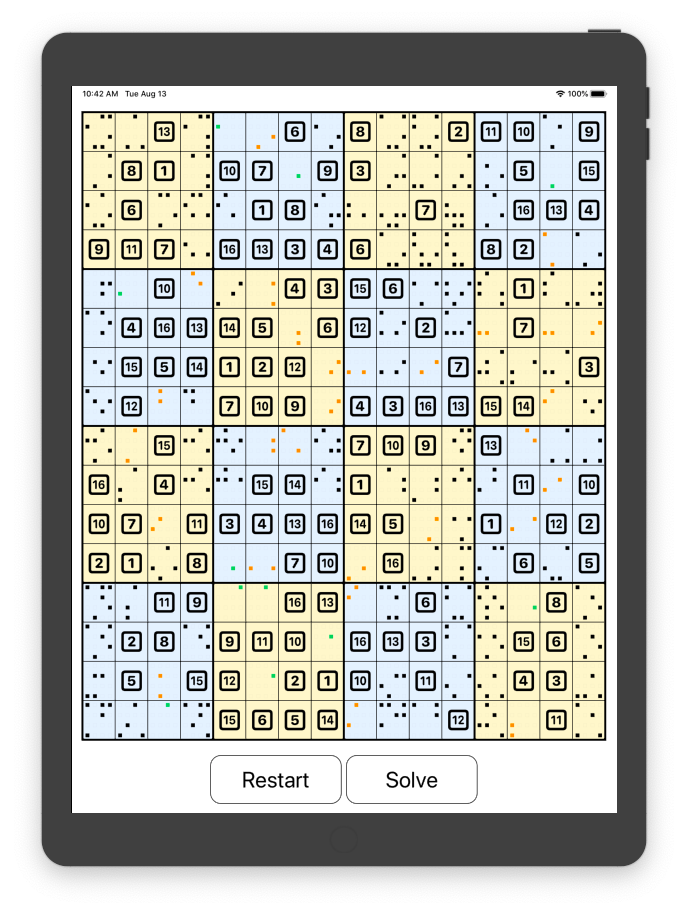
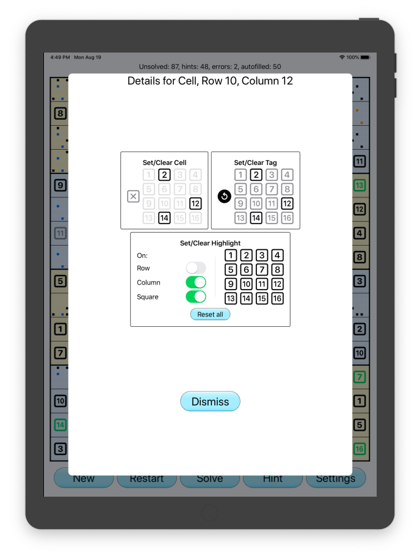
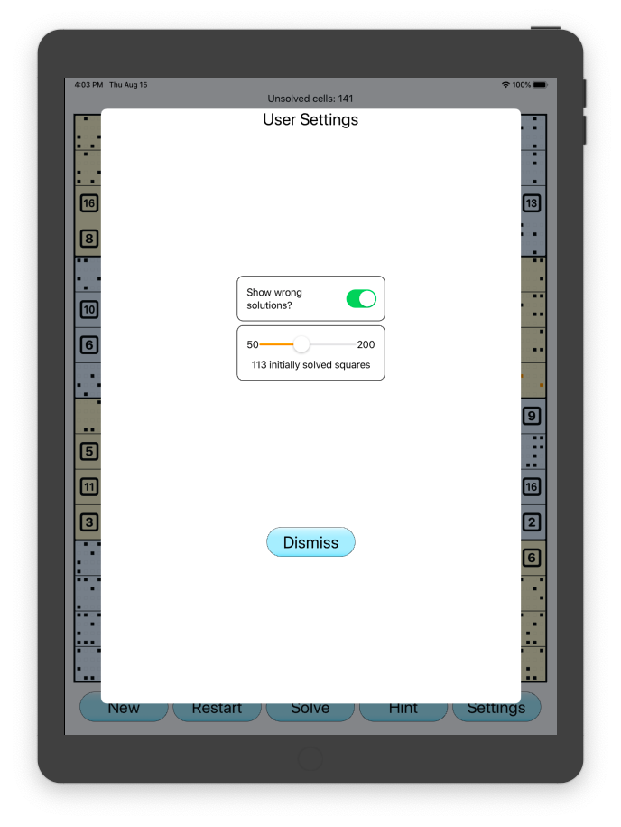

# 数独 十六
Popular puzzle but with 16 numbers written with SwiftUI

## Main Screen

The main screen shows the state of the board. At the very top is a count of the number
of unsolved squares, below it is the board, sixteen squares of sixteen cells. At the bottom
is a number of buttons.

Each cell displays the cells assigned number or if none has been assigned then the numbers
it could become. Numbers shown in red don't match the solution and those in green are the 
result of a hint.

The dots in a cell can also take on colours. If a dot is green it is because it is the only
possible number. Dots are yellow when there are two possibilities. Numbers can also be highlighted,
in which case the are blue.

Tapping in a square opens the details screen, which is shown below.

#### New
Start on a completely new puzzle.

#### Restart
Start again but with the same puzzle. The number shown will probably differ.

#### Solve
Solve the puzzle.

#### Hint
Fill in a random square.

#### Settings
Show the settings screen, see below.

## Details Screen

## Settings Screen

